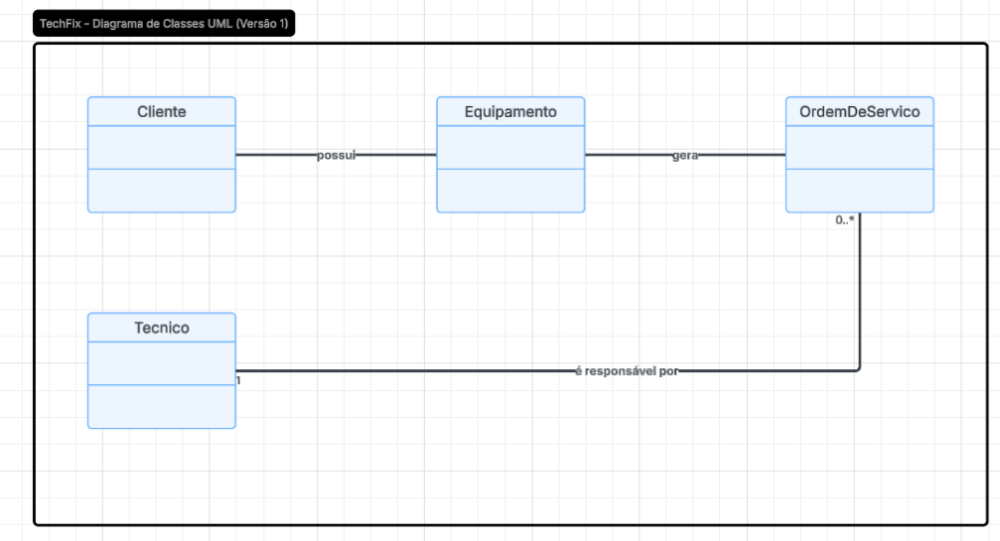

# Atividade Semanal nº 02 - Modelagem Inicial do Projeto TechFix

## Sobre a atividade

Nesta etapa do projeto **TechFix - Sistema de Assistência Técnica**, foi realizada a primeira atividade de modelagem do sistema.

O objetivo foi identificar as principais entidades do domínio e criar um primeiro rascunho do diagrama de classes UML.

---

## O que foi realizado

Durante a atividade foram definidas as quatro primeiras classes de domínio do sistema:

- **Cliente**: representa o usuário que solicita o serviço de assistência técnica.
- **Equipamento**: representa o aparelho que será levado para reparo.
- **OrdemDeServico**: representa o registro do atendimento e do conserto realizado.
- **Tecnico**: representa o profissional responsável pelo reparo.

Também foram definidos os principais relacionamentos entre essas classes.

---

## Relacionamentos definidos

### Cliente e Equipamento

Um cliente pode possuir vários equipamentos cadastrados.

```
Cliente (1) -------- (0..*) Equipamento
```

Associação: **possui**


### Equipamento e OrdemDeServico

Um equipamento pode possuir várias ordens de serviço.

```
Equipamento (1) -------- (0..*) OrdemDeServico
```

Associação: **gera**


### Tecnico e OrdemDeServico

Um técnico pode ser responsável por várias ordens de serviço.

```
Tecnico (1) -------- (0..*) OrdemDeServico
```

Associação: **é responsável por**

---

# Diagrama de Classes UML - Versão 1

O diagrama abaixo representa o primeiro esboço da estrutura do sistema, contendo as classes identificadas e seus relacionamentos principais.



---

## Decisões tomadas

Nesta primeira versão foram consideradas apenas as entidades principais do domínio.

Não foram adicionados atributos e métodos, pois o objetivo desta etapa foi validar a estrutura inicial do sistema e os relacionamentos entre as classes.

---

## Próximos passos

As próximas etapas do projeto serão:

- Adicionar atributos às classes;
- Definir métodos e responsabilidades;
- Evoluir o diagrama de classes;
- Iniciar a implementação do sistema.

---

## Controle da atividade

Alteração realizada:
- Criação do primeiro diagrama de classes UML;
- Documentação da modelagem inicial do projeto.
