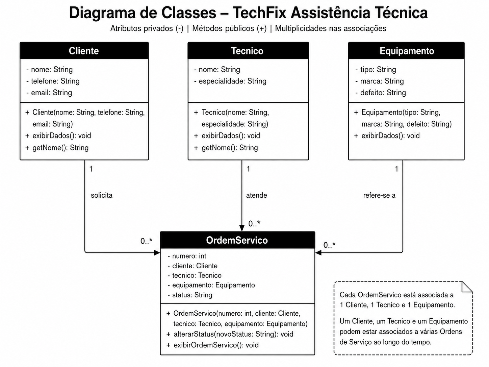

# Diagrama de Classes — Implementação Java

Este documento descreve o diagrama de classes correspondente à implementação básica em Java do TechFix. As classes estão em [`backend/src`](../backend/src/README.md) e utilizam somente recursos da linguagem Java, sem frameworks, banco de dados ou integração com o frontend.

## Diagrama



No diagrama, o sinal `-` representa atributos privados e o sinal `+` representa construtores e métodos públicos. As multiplicidades mostram quantas instâncias podem participar de cada associação.

## Classes documentadas

### Cliente

Representa a pessoa que solicita o atendimento. Armazena `nome`, `telefone` e `email`. O método `exibirDados()` apresenta essas informações, enquanto `getNome()` retorna o nome do cliente.

### Tecnico

Representa o profissional responsável pelo atendimento. Armazena `nome` e `especialidade`. O método `exibirDados()` apresenta os dados profissionais e `getNome()` retorna o nome do técnico.

### Equipamento

Representa o item encaminhado à assistência técnica. Armazena `tipo`, `marca` e `defeito`. O método `exibirDados()` apresenta os dados do equipamento.

### OrdemServico

Centraliza o atendimento. Armazena o `numero`, as referências para `cliente`, `tecnico` e `equipamento`, além do `status`. Seu construtor define o status inicial como `Aberta`. O método `alterarStatus()` atualiza essa situação e `exibirOrdemServico()` apresenta todos os dados relacionados.

## Relacionamentos e multiplicidades

Cada `OrdemServico` está associada exatamente a:

- um `Cliente`;
- um `Tecnico`;
- um `Equipamento`.

Ao longo do tempo, cada cliente, técnico ou equipamento pode estar associado a zero ou várias ordens de serviço (`0..*`). Isso expressa uma associação entre os objetos, implementada pelas referências armazenadas dentro de `OrdemServico`.

O diagrama usa os verbos **solicita**, **atende** e **refere-se a** para esclarecer o papel de cada classe na relação com a ordem.

## Classe Main

`Main` não aparece no diagrama porque não representa uma entidade do domínio. Ela serve como ponto de entrada para demonstrar a criação de um cliente, um técnico, um equipamento e uma ordem, além da consulta e alteração de status.

## Organização realizada

A atividade Java foi isolada do frontend na estrutura abaixo:

```text
backend/
└── src/
    ├── Cliente.java
    ├── Equipamento.java
    ├── Main.java
    ├── OrdemServico.java
    ├── Tecnico.java
    └── README.md
```

A implementação permanece sem declarações de `package`, dependências externas, Maven, Gradle, Spring ou API. Ela foi validada com JDK 17.0.10 por meio da compilação com `javac` e da execução de `Main`.
