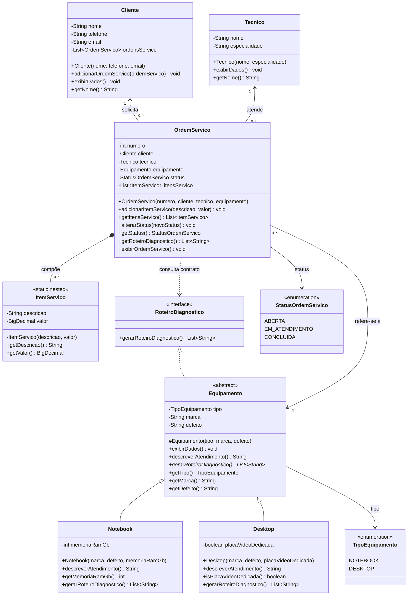
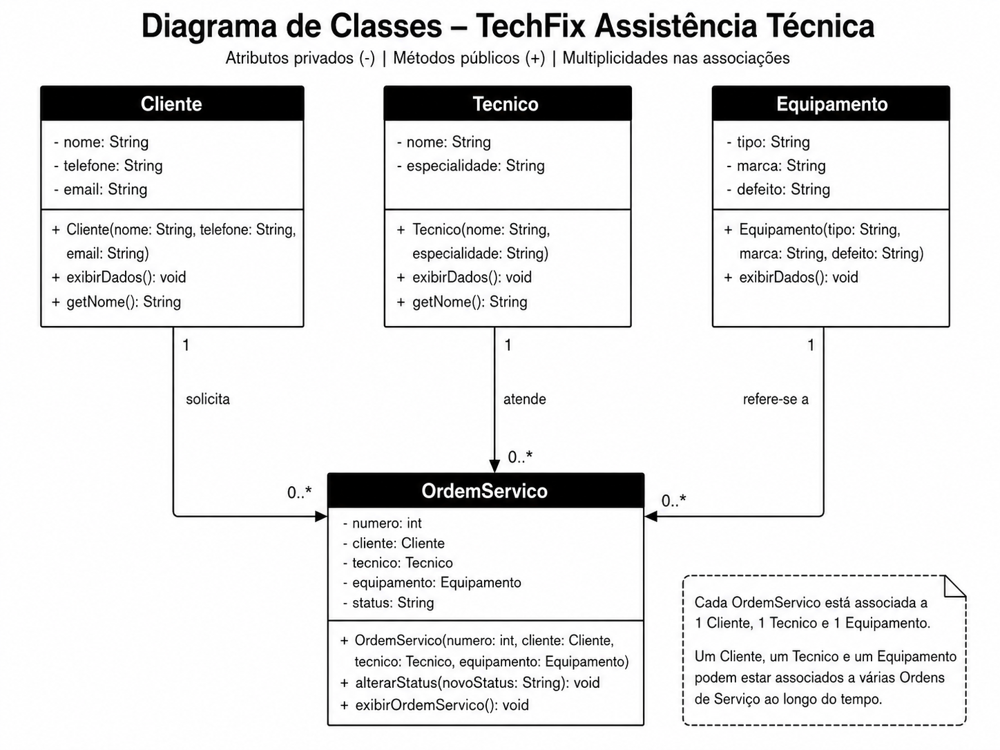

# Diagrama de Classes — Implementação Java

Este documento descreve o diagrama de classes correspondente à implementação básica em Java do TechFix. As classes estão em [`backend/src`](../backend/src/README.md) e utilizam somente recursos da linguagem Java, sem frameworks, banco de dados ou integração com o frontend.

## Diagrama atual

O diagrama abaixo corresponde à AP2, incluindo os incrementos das atividades 6 a 9. [Versão visual atual em SVG](Diagrama-AP2.svg).


```mermaid
classDiagram
    class Cliente {
        -String nome
        -String telefone
        -String email
        -List~OrdemServico~ ordensServico
        +Cliente(nome, telefone, email)
        +adicionarOrdemServico(ordemServico) void
        +exibirDados() void
        +getNome() String
    }
    class Tecnico {
        -String nome
        -String especialidade
        +Tecnico(nome, especialidade)
        +exibirDados() void
        +getNome() String
    }
    class Equipamento {
        <<abstract>>
        -TipoEquipamento tipo
        -String marca
        -String defeito
        #Equipamento(tipo, marca, defeito)
        +exibirDados() void
        +descreverAtendimento() String
        +gerarRoteiroDiagnostico() List~String~*
        +getTipo() TipoEquipamento
        +getMarca() String
        +getDefeito() String
    }
    class Notebook {
        -int memoriaRamGb
        +Notebook(marca, defeito, memoriaRamGb)
        +descreverAtendimento() String
        +getMemoriaRamGb() int
        +gerarRoteiroDiagnostico() List~String~
    }
    class Desktop {
        -boolean placaVideoDedicada
        +Desktop(marca, defeito, placaVideoDedicada)
        +descreverAtendimento() String
        +isPlacaVideoDedicada() boolean
        +gerarRoteiroDiagnostico() List~String~
    }
    class OrdemServico {
        -int numero
        -Cliente cliente
        -Tecnico tecnico
        -Equipamento equipamento
        -StatusOrdemServico status
        -List~ItemServico~ itensServico
        +OrdemServico(numero, cliente, tecnico, equipamento)
        +adicionarItemServico(descricao, valor) void
        +getItensServico() List~ItemServico~
        +alterarStatus(novoStatus) void
        +getStatus() StatusOrdemServico
        +getRoteiroDiagnostico() List~String~
        +exibirOrdemServico() void
    }
    class ItemServico {
        <<static nested>>
        -String descricao
        -BigDecimal valor
        -ItemServico(descricao, valor)
        +getDescricao() String
        +getValor() BigDecimal
    }
    class TipoEquipamento {
        <<enumeration>>
        NOTEBOOK
        DESKTOP
    }
    class RoteiroDiagnostico {
        <<interface>>
        +gerarRoteiroDiagnostico() List~String~
    }
    class StatusOrdemServico {
        <<enumeration>>
        ABERTA
        EM_ATENDIMENTO
        CONCLUIDA
    }

    Cliente "1" <-- "0..*" OrdemServico : solicita
    Tecnico "1" <-- "0..*" OrdemServico : atende
    Equipamento "1" <-- "0..*" OrdemServico : refere-se a
    Equipamento <|-- Notebook
    Equipamento <|-- Desktop
    RoteiroDiagnostico <|.. Equipamento
    OrdemServico ..> RoteiroDiagnostico : consulta contrato
    Equipamento --> TipoEquipamento : tipo
    OrdemServico --> StatusOrdemServico : status
    OrdemServico "1" *-- "0..*" ItemServico : compõe
```

## Imagem da etapa anterior



A imagem foi preservada como registro da etapa anterior, quando `Equipamento.tipo` e `OrdemServico.status` ainda eram textos. No diagrama atual, o sinal `-` representa atributos privados e o sinal `+` representa construtores e métodos públicos. As multiplicidades mostram quantas instâncias podem participar de cada associação.

## Classes documentadas

### Cliente

Representa a pessoa que solicita o atendimento. Armazena `nome`, `telefone`, `email` e uma `List<OrdemServico>` inicializada na declaração. O método `adicionarOrdemServico()` rejeita valores nulos e inclui uma ordem na coleção; `exibirDados()` apresenta os dados e `getNome()` retorna o nome do cliente.

### Tecnico

Representa o profissional responsável pelo atendimento. Armazena `nome` e `especialidade`. O método `exibirDados()` apresenta os dados profissionais e `getNome()` retorna o nome do técnico.

### Equipamento

É a superclasse abstrata dos itens encaminhados à assistência. Centraliza `tipo`, `marca`, `defeito`, suas validações, getters e a exibição. `Notebook` e `Desktop` herdam esses comportamentos e sobrescrevem `descreverAtendimento()` para acrescentar, respectivamente, memória RAM e configuração de vídeo.

### OrdemServico

Centraliza o atendimento. Armazena o `numero`, as referências para `cliente`, `tecnico` e `equipamento`, além do `status`. Também compõe uma lista de `ItemServico`, cujos objetos nascem internamente. Seu construtor define o status inicial como `ABERTA`; `alterarStatus()` atualiza a situação e `exibirOrdemServico()` apresenta os dados relacionados.

## Relacionamentos e multiplicidades

Cada `OrdemServico` está associada exatamente a:

- um `Cliente`;
- um `Tecnico`;
- um `Equipamento`.

Ao longo do tempo, cada cliente, técnico ou equipamento pode estar associado a zero ou várias ordens de serviço (`0..*`). Na associação principal da Atividade 6, essa multiplicidade é implementada pela coleção `List<OrdemServico>` mantida por `Cliente`. A referência `cliente` de `OrdemServico` representa o outro sentido dessa associação.

O diagrama usa os verbos **solicita**, **atende** e **refere-se a** para esclarecer o papel de cada classe na relação com a ordem.

As setas de generalização mostram que `Notebook` e `Desktop` são especializações de `Equipamento`. O losango preenchido registra a composição entre `OrdemServico` e `ItemServico`.

Na composição, a ordem também pode ter zero ou vários itens (`0..*`); cada item pertence à ordem que o criou. `ItemServico` é uma classe aninhada estática com construtor privado. A seta tracejada com triângulo representa a realização de `RoteiroDiagnostico` por `Equipamento`; a seta tracejada simples representa a consulta da OS ao contrato. Herança e realização de interface não recebem multiplicidades.

`0..*` expressa a relação de um para muitos sem exigir uma ordem ou um item já no cadastro. Usar `1..*` seria incompatível com as listas inicialmente vazias do código atual.

### RoteiroDiagnostico — Atividade 9

Define `gerarRoteiroDiagnostico()`, com etapas ordenadas, não vazias, imutáveis e sem efeitos colaterais. `Equipamento` implementa o contrato como classe abstrata, enquanto `Notebook` e `Desktop` fornecem as etapas concretas. `OrdemServico.getRoteiroDiagnostico()` delega ao equipamento por uma referência da interface, sem selecionar tipos com `instanceof`.

## Classe Main

`Main` não aparece no diagrama porque não representa uma entidade do domínio. Ela demonstra a ordem e percorre um notebook e um desktop por meio de referências `Equipamento`, evidenciando o comportamento polimórfico das sobrescritas.

## Organização realizada

A atividade Java foi isolada do frontend na estrutura abaixo:

```text
backend/
├── pom.xml
└── src/
    ├── README.md
    ├── main/java/
    │   ├── Cliente.java
    │   ├── Desktop.java
    │   ├── Equipamento.java
    │   ├── Main.java
    │   ├── Notebook.java
    │   ├── OrdemServico.java
    │   ├── RoteiroDiagnostico.java
    │   ├── StatusOrdemServico.java
    │   ├── Tecnico.java
    │   └── TipoEquipamento.java
    └── test/java/
        ├── EquipamentoTest.java
        ├── OrdemServicoTest.java
        └── RoteiroDiagnosticoTest.java
```

A implementação permanece sem declarações de `package`, Spring, banco de dados ou API. O Maven foi adicionado para compilar o projeto e executar os testes JUnit 5. Os fontes principais foram validados com JDK 17.0.10 por meio da compilação com `javac` e da execução de `Main`.
