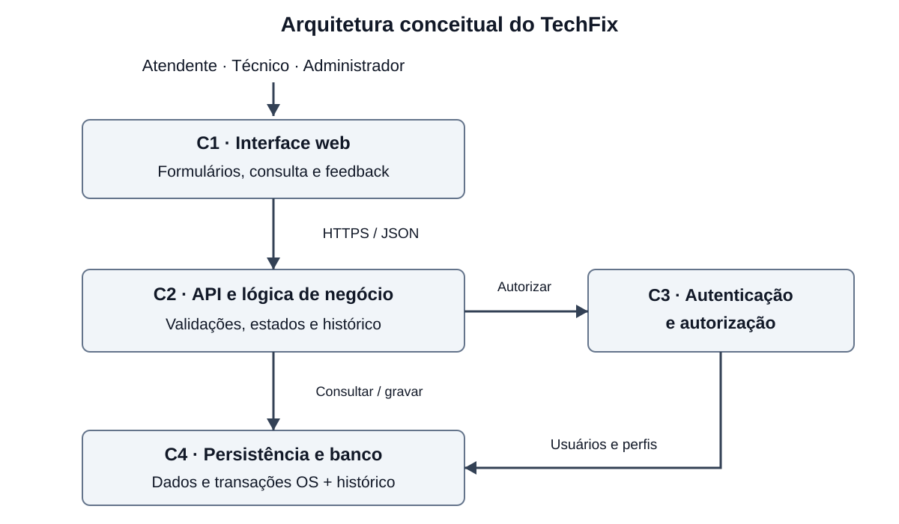

# A10 Arquitetura e rastreabilidade

## 1. Identificação

Atividade (código e nome): A10 — Arquitetura e rastreabilidade — Entrega final

Disciplina: Processos de Engenharia de Software

Etapa (AP1 / AP2 / AS): AP2

Equipe: TechFix

Integrantes: Arthur Scharfenberger e Lucas Oliveira da Silva

Data de elaboração: 07/10/2026

Prazo da atividade: início do Encontro 11, apresentação da AP2.

## 2. Conteúdo da atividade

### 2.1 Objetivo e referências

A arquitetura organiza o TechFix em quatro componentes e relaciona os oito requisitos da A5 ao backlog da A8, aos modelos e ao processo da A7. O objetivo é orientar a implementação dos incrementos I1 e I2 com autorização no servidor, integridade do histórico e validação pelo Product Owner.

A A5 validada é a linha de base dos requisitos e prioridades. A4 registra os vínculos RE1–RE5 com a entrevista A3. A8-Entrega-Final-Revisada.md detalha os itens A8R01–A8R09. Os modelos consultados estão em Modelagem-Entrega-Final.md, seções 2.2 e 2.3. A7-Processo-Entrega-Final.md define processo, papéis, fluxo e Definition of Done. A A2 adota desenvolvimento incremental com práticas ágeis; a A6 de Arthur propõe revisão criteriosa antes de concluir. A revisão de coerência desta entrega considera A2 a A9.

### 2.2 Componentes e comunicação

Figura 1. C1 envia operações a C2; C2 consulta C3 antes de executar operações protegidas e utiliza C4 para persistência. C3 consulta usuários e perfis em C4. As setas representam solicitações; as respostas retornam ao solicitante. Diagrama vetorial editável, sem geração de imagem por IA.

| Componente | Responsabilidade | Comunicação |
|---|---|---|
| C1 — Interface web | Cadastro, abertura, consulta e atualização de OS; validação visual, mensagens e confirmação. | API HTTP/JSON de C2; HTTPS na implantação. |
| C2 — API e lógica de negócio | Validar dados e vínculo cliente/equipamento; gerar número e data; controlar responsável, estados e histórico. | Solicita autorização a C3 e consultas/transações a C4. |
| C3 — Autenticação e autorização | Identificar o usuário e verificar perfil e permissão por operação conforme RNF2. | Atua no servidor; consulta usuários/perfis em C4. |
| C4 — Persistência e banco de dados | Armazenar clientes, equipamentos, OS, técnicos, usuários/perfis e eventos. | Responde às consultas de C2/C3; confirma ou desfaz transações. |

A interface não acessa diretamente o banco. Ocultar botões não substitui autorização: solicitações diretas à API também passam por C3. C2/C3/C4 podem integrar uma única aplicação no servidor; a divisão é de responsabilidades e não exige microsserviços. Framework e banco serão definidos no detalhamento técnico.

Não há integração externa necessária à linha de base. E-mail, WhatsApp, pagamentos, avaliação e relatório gerencial dependem de requisito aprovado para entrar no backlog.

### 2.3 Abertura e evolução da ordem de serviço

1. O atendente seleciona ou cadastra cliente e equipamento em C1.
2. C2 recebe a solicitação; C3 verifica identidade e permissão.
3. C2 valida nome, telefone, tipo, defeito e vínculo entre cliente e equipamento.
4. C2 gera número único, data/hora e estado ABERTA. C4 grava OS e evento inicial de histórico na mesma transação.
5. C1 apresenta o protocolo somente após confirmação de gravação. Em falha, mantém os dados para nova tentativa; um reenvio deve reutilizar a identificação da operação, evitando duplicação.

O técnico pode ser atribuído após a abertura. C2 exige responsável para iniciar o atendimento e controla ABERTA → EM ATENDIMENTO → CONCLUÍDA, rejeitando regressão da OS concluída. Alteração de estado/responsável e evento de histórico são gravados juntos, com usuário, data/hora e alteração.

### 2.4 Relação com Scrum e a A7

A A7 define Scrum, papéis, fluxo de trabalho e Definition of Done em A7-Processo-Entrega-Final.md, seções 2.1 a 2.5. As ligações abaixo aplicam esse processo à arquitetura. Arthur acumula Scrum Master e desenvolvimento; Lucas atua no desenvolvimento; Chico Mosca é o PO. A distribuição técnica inicial é ajustada no planejamento de cada Sprint semanal.

| Elemento da A7 | Aplicação na arquitetura e no backlog | Evidência esperada |
|---|---|---|
| Planejamento e trabalho da dupla | Arthur pode implementar C1 e Lucas C2/C4; C3 exige acordo sobre permissões e revisão de ambos. Definir contratos de requisição, resposta e erro antes da implementação permite trabalhar em componentes diferentes. | Itens A8R selecionados e contrato de API registrado no planejamento. |
| Definition of Done: revisão por outro integrante | Conforme A7 2.5, quem implementa solicita revisão ao colega. Verificar vínculo A5/A8R, validações, autorização, transações, testes e documentação. | Registro do revisor, correções resolvidas e evidências dos critérios. |
| Integração dos componentes | A divisão não dispensa demonstrar o fluxo C1 → C2 → C3/C4. O incremento precisa funcionar para o usuário. | Demonstração integrada e evidências dos critérios de aceitação do incremento. |
| Validação do PO | Conforme A7 2.4, Chico Mosca inspeciona a saída de C1: campos, erros, protocolo, estado e histórico. A decisão de negócio é registrada separadamente da conclusão técnica. | Cenário, resultado observado e aceite ou ajustes; ausência de PO não equivale a aceite. |

No I1, a validação do PO cobre cadastro, abertura ABERTA, recuperação pelo número e histórico inicial. No I2, cobre acompanhamento pelo técnico, conclusão, buscas por cliente/equipamento e consulta da evolução. Os testes da equipe comprovam autorização, transações e desempenho; a validação do PO verifica se os resultados apresentados atendem ao trabalho da assistência.

### 2.5 Matriz de rastreabilidade

A origem documental é Atividade_03_Levantamento_Requisitos_TechFix.pdf: entrevista semiestruturada simulada com Marcos Almeida, atendente, resumida na seção 3 (páginas 1–2). A seção 4 enumera os requisitos extraídos; esses IDs são usados abaixo, sem inventar respostas R01/R02. O arquivo contém resumo narrativo, não transcrição de perguntas e respostas. Os códigos RE são referências intermediárias da A4; a numeração da A3 não é igual à da A4/A5. Chico Mosca é o PO indicado no planejamento A7, não o entrevistado simulado da A3.

| Requisito da A5 | Origem A3 e referência intermediária | Backlog e incremento | Modelo ou decisão arquitetural | Componentes |
|---|---|---|---|---|
| RF1 — Cadastro; HU1 | A3 §4.1, p. 2, RF01/RF02; §4.3, p. 3, RF14. A4 RE1: cliente/equipamento. | A8R02; I1 | Modelo final 2.2/2.3: seleção, cadastro rápido e campos obrigatórios. | C1 recebe; C2 valida vínculo e campos; C4 grava. |
| RF2 — Criar e acompanhar OS; HU1/HU2 | A3 §3 e §4.1, p. 2, RF03–RF05. A4 RE2: OS, estado e técnico. | A8R03; I1. A8R06/A8R07; I2 | Modelo final 2.2/2.3: abertura. A10 2.3: responsável e evolução. | C1 recebe ações; C2 controla ciclo; C4 grava OS/eventos. |
| RF3 — Pesquisa e histórico; HU1/HU2 | A3 §4.1, p. 2, RF06/RF07. A4 RE3: pesquisa e histórico. | A8R04/A8R05; I1. A8R05/A8R08; I2 | Modelo final 2.2: evento inicial. A10 2.6: busca exata/parcial, filtro e eventos cronológicos. | C1 apresenta; C2 consulta/ordena; C4 armazena. |
| RN1 — Ciclo de estados; HU1/HU2 | A3 §4.1, p. 2, RF04. A4 RE2/RN1: estados; proibição de regressão refinada na A5. | A8R03; I1. A8R06/A8R07; I2 | Modelo final 2.2: ABERTA. A10 2.3: transições e proibição de regressão. | C2 aplica a regra; C4 persiste estado/evento; C1 informa. |
| RNF1 — Desempenho; transversal a HU1/HU2 | A3 §4.2, p. 2–3, RNF01–RNF03. A4 RE5: simplicidade/agilidade. Limites numéricos definidos na A5. | A8R09; I2 | A8 2.4 e A10 2.6: até 10.000 OS, com 95% das operações em até 2 s. | C1 delimita tempo percebido; C2/C4 processam e permitem medição. |
| RNF2 — Acesso por perfil; transversal a HU1/HU2 | A3 §4.1, p. 2, RF12; §4.3, p. 3, RNF04/RNF05. A4 RE4: acesso por perfil. | A8R01; I1 e aplicação transversal no I2 | Modelo final 2.2: decisão de autorização. A10 2.2: controle no servidor. | C3 verifica; C2 aplica antes da operação; C4 mantém perfis. |
| HU1 — Atendente cadastra e localiza OS | A3 §3 e §4.1, p. 2, RF01–RF03/RF06/RF07. A4 RE1/RE3: atendente registra e localiza. | A8R02–A8R05; I1. A8R08; I2 | Modelo final 2.2/2.3: recepção e abertura. A10 2.6: consulta e histórico. | C1 apoia o atendente; C2/C4 realizam o fluxo; C3 autoriza. |
| HU2 — Técnico acompanha e atualiza suas OS | A3 §4.1, p. 2, RF04/RF05/RF12. A4 RE2/HU2: acompanhamento pelo técnico. | A8R05; base no I1. A8R05–A8R07; I2 | A10 2.3/2.6: lista atribuída, início e conclusão; modelo específico de tela a detalhar. | C1 apoia o técnico; C2 filtra/controla; C3 autoriza; C4 registra. |

Os modelos atuais detalham cadastro e abertura. A matriz distingue essa cobertura das decisões arquiteturais para consulta e atualização; não atribui aos wireframes telas que eles não contêm.

### 2.6 Verificação derivada da arquitetura

| Cenário | Resultado esperado | Requisitos e componentes |
|---|---|---|
| Cadastro incompleto ou equipamento de outro cliente | Bloquear a operação, indicar pendências e manter formulário. | RF1/HU1; C1/C2/C4 |
| Falha ao gravar OS ou seu evento inicial | Desfazer ambos; não exibir protocolo de sucesso. | RF2/RF3; C2/C4 |
| Técnico inicia OS atribuída e depois conclui | Registrar responsável e cada evento; impedir retorno após CONCLUÍDA. | RF2/RN1/HU2; C2/C3/C4 |
| Busca por número, cliente ou equipamento | Número exato retorna a OS; nome parcial retorna correspondências; equipamento filtra suas OS. Histórico em ordem cronológica com data/hora, usuário e alteração. | RF3/HU1; C1/C2/C4 |
| Perfil sem permissão chama diretamente a API | Negar 100% das tentativas a dados administrativos/valores, sem leitura ou alteração indevida. | RNF2; C2/C3/C4 |
| Operações principais com até 10.000 OS | Pelo menos 95% em até 2 s; registrar cenário, ambiente e medições por fluxo conforme A8 2.4. | RNF1; C1/C2/C4 |

Esses cenários são critérios propostos para implementação e validação, não resultados de testes executados do sistema integrado.

### 2.7 Relação com o projeto atual

O frontend TypeScript/Vite utiliza armazenamento local no navegador. As classes Java representam parte do domínio e executam separadamente. API, autenticação no servidor, banco e integração entre frontend e Java são propostos; esta entrega não os declara implementados. As regras e contratos aqui descritos orientam a evolução do protótipo.

### 2.8 Revisão de coerência entre os artefatos

| Artefato e fonte | Conferência realizada | Correção ou resultado |
|---|---|---|
| A2 — atividade02-12-08.pdf, seção 2 | Ciclo incremental com práticas ágeis e possibilidade de feedback. | A7 adota Scrum; I1/I2 organizam valor. Relatórios citados como possibilidades na A2 não entram automaticamente na linha de base da A5. |
| A3 — Atividade_03_Levantamento_Requisitos_TechFix.pdf | Entrevista simulada com Marcos Almeida; resumo §3 e requisitos §4, p. 1–3. | Matriz vinculada aos IDs originais. Não se apresenta simulação como entrevista real nem resumo como transcrição. |
| A4 — Atividade04.md | IDs, histórias e vínculos de origem. | RF1/RF2/RF3, RN1, RNF1/RNF2 e HU1/HU2 preservados; HU2 vinculada a RE2. |
| A5 — requisitos validados e feedback | Campos, estados, consulta, prioridades e volume de dados. | Adotados os critérios e até 10.000 OS. A cópia local da tabela 2.2.1 difere da versão avaliada e deve ser sincronizada. |
| A6 — reflexão individual de Arthur | Revisão antes de concluir e registro de decisões por incremento. | A7 2.5 transforma a melhoria em DoD; A10 2.4 exige evidências e revisão cruzada. |
| A7 — A7-Processo-Entrega-Final.md | Processo, papéis, revisão e validação do PO. | Ligações explícitas com C1–C4; conclusão técnica separada da decisão de negócio. |
| A8 — A8-Entrega-Final-Revisada.md | Oito requisitos, nove itens e dois incrementos. | Mesmos IDs, prioridades e estados; pagamento, avaliação e relatório fora da linha de base. Consenso de estimativas deve ser registrado pela dupla. |
| A9 — referência local Modelagem-Entrega-Final.md | Fluxograma e wireframe de cadastro/abertura, seções 2.2/2.3. | A arquitetura preserva validação, autorização, histórico e tratamento de falhas; telas de consulta/atualização não são atribuídas aos modelos existentes. |

A conferência demonstra alinhamento entre o processo definido, o backlog revisado, os modelos consultados e os componentes propostos. O fechamento documental ainda exige a sincronização da A5 avaliada e a confirmação do arquivo entregue da A9. A origem foi vinculada ao resumo e aos requisitos da A3 fornecida; respostas literais não constam desse arquivo. Esses pontos não são apresentados como verificações já concluídas.

### 2.9 Correções em relação ao esboço

| No esboço Arquitetura-Rastreabilidade-Esboco.md | Na versão final | Evidência |
|---|---|---|
| Caminho textual entre componentes. | Diagrama vetorial com C1–C4 e setas de comunicação. | Seção 2.2 e A10-Arquitetura.svg. |
| Matriz inicial com três requisitos. | Oito requisitos/histórias, com backlog, modelos e componentes. | Seção 2.5; origem A3 por seção, página e ID, preservando o caráter simulado. |
| Processo da A7 não conectado. | Scrum, papéis, DoD e validação do PO ligados aos componentes. | Seção 2.4 e A7 final 2.2–2.5. |
| Ausência de revisão sistemática entre artefatos. | Conferência por artefato e registro das inconsistências. | Seção 2.8. |
| Formato simples de oficina. | Cinco seções da ficha padrão, disciplina e prazo identificados. | Seções 1 a 5. |
| Evolução de estados sem cobertura completa da matriz. | RN1 e HU2 ligados à atribuição, início, conclusão e histórico. | Seções 2.3, 2.5 e 2.6. |

## 3. Decisões e pendências

Decisões documentadas: manter C1–C4, autorização no servidor e transação única para OS/histórico; cobrir os oito requisitos da A5; relacionar arquitetura à revisão por outro integrante e à validação da saída de C1 pelo PO; manter integrações externas fora da linha de base.

Pendências / próximos passos: confirmar a correspondência da modelagem local com a A9 entregue; sincronizar a A5 avaliada e conferir sua matriz de perfis; concluir a revisão em dupla e assinar. A A7 produzida nesta elaboração está vinculada ao índice. O Registro-Revisao-Equipe.md concentra os campos de fechamento.

## 4. Declaração de uso de Inteligência Artificial

Conforme o Manual da Disciplina (seção 6 — Uso de Inteligência Artificial), toda utilização relevante de IA no desenvolvimento desta atividade deve ser declarada abaixo e também registrada no arquivo DEVLOG.md do repositório do projeto.

( ) A equipe não utilizou ferramentas de IA nesta atividade.

(X) A equipe utilizou ferramentas de IA nesta atividade — declaração abaixo.

| Data e ferramenta | Objetivo do uso | Prompt ou resumo da interação | Resultado aproveitado / rejeitado / modificado |
|---|---|---|---|
| 30/09/2026 — ChatGPT/Codex | Organizar o esboço. | Relacionar requisitos, backlog, modelos e componentes. | Base dos componentes C1–C4 e fluxo de abertura. |
| 07/10/2026 — ChatGPT/Codex | Corrigir a A10 conforme feedback. | Completar matriz, desenhar arquitetura e explicitar vínculos com A7 e validação do PO. | Matriz dos oito requisitos, diagrama vetorial e ficha padrão. Origem A3 complementada por página/seção/ID na preparação da AP2. Citações, consenso e assinaturas não foram inventados. |

Forma de verificação: confronto com feedback, A3 fornecida (p. 1–3), A4, critérios/prioridades locais da A5, A8 revisada e modelos. Conferência dos IDs, dependências e distinção entre arquitetura proposta e implementação. Revisão da equipe registrada separadamente.

Responsável pela decisão final sobre o uso: Arthur Scharfenberger e Lucas Oliveira da Silva.

## 5. Responsabilidade e autoria

A equipe declara que este documento foi lido, compreendido e validado por todos os integrantes, que respondem integralmente pela correção, coerência, legalidade e autoria do conteúdo entregue. Qualquer integrante poderá ser questionado, em apresentação, sobre partes produzidas com apoio de IA.

Assinatura (nomes por extenso):

Arthur Scharfenberger: ____________________________________________________

Lucas Oliveira da Silva: ____________________________________________________
