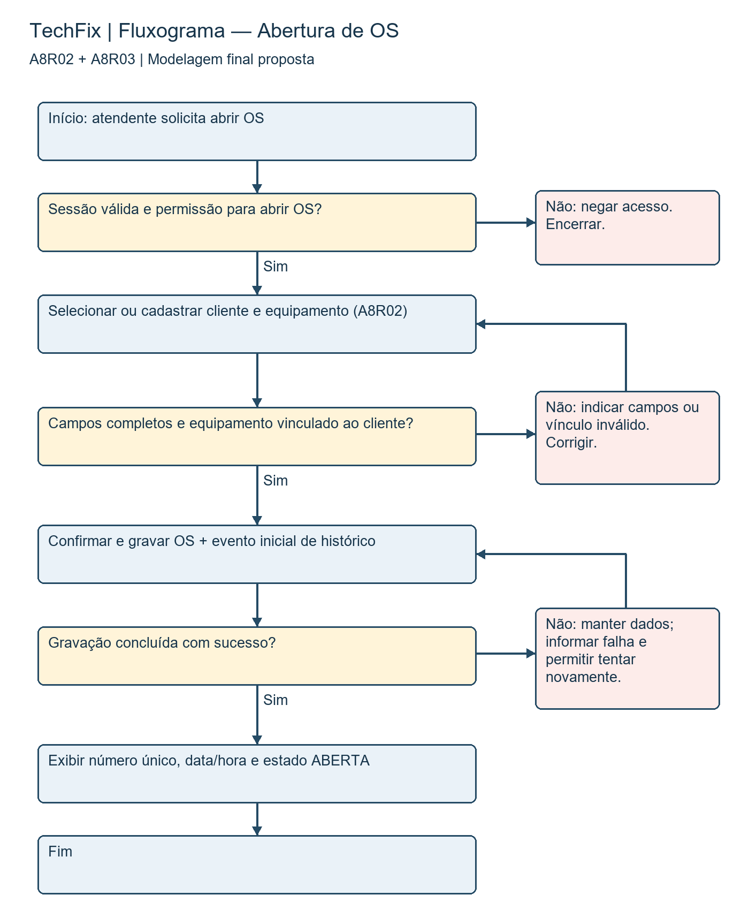
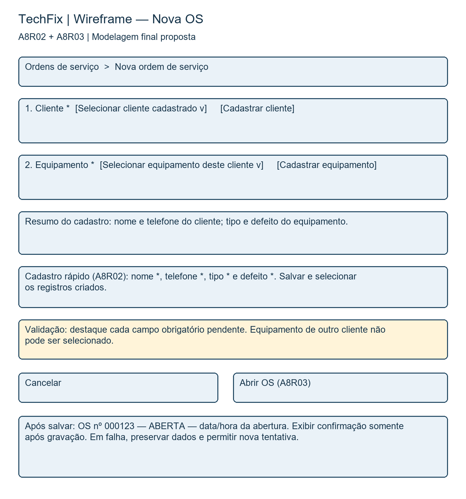

# Modelagem — Parte 2: entrega final

## 1. Identificação

Atividade (código e nome): Modelagem — Parte 2: entrega final

Etapa (AP1 / AP2 / AS): ____________________ (confirmar no AVA)

Equipe: TechFix

Integrantes: Arthur Scharfenberger e Lucas Oliveira da Silva

Data de entrega: ____________________ (preparação: 30/09/2026)

## 2. Conteúdo da atividade

## 2.1 Objetivo e conexão com o backlog

Modelar A8R02 (cadastro de cliente e equipamento) e A8R03 (abertura de OS), Must have do incremento I1 em A8-Entrega-Final.docx. O usuário principal é o atendente. Modelos de especificação proposta: representam comportamento desejado e não comprovam implementação.

| Modelo | Itens principais e origem | Contribuição |
|---|---|---|
| Fluxograma | A8R02 → RF1/HU1; A8R03 → RF2/RN1/HU1 | Explicita sequência, decisões, correções e sucesso da abertura. |
| Wireframe | A8R02 → RF1/HU1; A8R03 → RF2/RN1/HU1 | Explicita seleção, cadastro, obrigatoriedade, mensagens e confirmação. |

Dependências transversais: A8R01/RNF2 controla o acesso; A8R05/RF3 registra o evento inicial. Isso não amplia as duas funcionalidades escolhidas: são condições para executá-las corretamente. Atualização pelo técnico e conclusão pertencem ao I2 e não são o foco destes modelos.

## 2.2 Modelo 1 — Fluxograma

## Explicação e decisão de modelagem

O modelo descreve o fluxo do atendente autorizado: selecionar ou cadastrar cliente e equipamento, validar dados e vínculo, confirmar e gravar OS com evento inicial, e receber número único, data/hora e estado ABERTA. As caixas amarelas representam decisões; as saídas negativas encerram acesso indevido ou retornam ao ponto corrigível.

O fluxograma foi escolhido para revelar caminhos alternativos que o esboço omitira. Impede tratar campos inválidos ou falhas de armazenamento como sucesso e torna explícito que a autorização precede a operação. Em falha de gravação, preservar o formulário; a nova tentativa deve reutilizar a identificação da operação para evitar OS duplicada caso a resposta anterior se perca. Esta é uma decisão de robustez proposta.

Pré-condição de sucesso: identidade e permissão válidas, cliente e equipamento cadastrados e relacionados. Pós-condição: uma OS persistida com número único, data, estado ABERTA e evento de abertura com usuário, data/hora e alteração. Não se permite gravação parcial da OS e do evento. A8R02 ocupa a etapa de cadastro/seleção; A8R03 ocupa confirmação, gravação e protocolo.

## 2.3 Modelo 2 — Wireframe

## Explicação e decisão de modelagem

O wireframe apresenta a tela Nova OS e os estados de feedback, reunidos na mesma figura como anotações de comportamento. Os avisos e a confirmação não precisam aparecer simultaneamente. O atendente seleciona um cliente e vê somente os equipamentos vinculados; se faltarem registros, o cadastro rápido de A8R02 solicita nome, telefone, tipo e defeito e devolve a seleção ao formulário.

A escolha de wireframe complementa o fluxo ao mostrar onde cada informação será fornecida e como o atendente recebe orientação. Os campos com asterisco são obrigatórios; erros são indicados junto ao campo correspondente. Número, data e estado não são digitados pelo usuário: são gerados na abertura de A8R03. O técnico pode permanecer não atribuído, pois o início do atendimento ocorre no I2.

Cancelar abandona a abertura sem criar OS; se houver dados não salvos, pedir confirmação de descarte. Abrir OS valida os dados e desabilita novos envios enquanto a operação está em andamento. Sucesso apresenta protocolo, data/hora e ABERTA; falha mantém os dados para correção ou nova tentativa. O sistema verifica permissão também na operação, independentemente da visibilidade do botão.

## 2.4 Cenários para validar os modelos

| Cenário | Resultado esperado / backlog |
|---|---|
| Cliente/equipamento válidos e atendente autorizado | Uma OS com número único, data/hora e ABERTA; evento inicial registrado. A8R02/A8R03. |
| Telefone, tipo ou defeito ausente | Cadastro bloqueado; todos os campos pendentes indicados. A8R02. |
| Equipamento pertence a outro cliente | Seleção/abertura impedida e vínculo solicitado novamente. A8R02/A8R03. |
| Usuário sem permissão | Operação negada e nenhuma OS criada. Dependência A8R01. |
| Falha de gravação ou reenvio | Sem confirmação falsa nem duplicação; dados preservados para nova tentativa. A8R03/A8R05. |

## 2.5 Correções do esboço

| Rascunho entregue nesta preparação | Ajuste na versão final | Ganho |
|---|---|---|
| Apenas caminho principal. | Adicionar decisões de autorização, validade e gravação. | Exceções e recuperação verificáveis. |
| Cadastro sem dados mínimos nem vínculo explícito. | Nome, telefone, tipo, defeito e seleção restrita ao cliente. | Atender RF1 e evitar OS com equipamento incorreto. |
| Mostrar número e estado apenas. | Acrescentar data/hora, persistência e evento de abertura. | Atender RF2 e a dependência de histórico. |
| Uma sequência sem representação da interface. | Incluir wireframe com seleção, cadastro rápido, ações e feedback. | Explicar como o atendente executa o fluxo. |

Comparação reproduzível: Modelagem-Esboco.docx e esboco-fluxograma.png preservam a versão inicial preparada agora. Não há evidência fornecida de um rascunho de modelagem produzido anteriormente em aula; portanto esta evolução é documental e não uma afirmação sobre acontecimentos da oficina.

3. Decisões e pendências

Registre as principais decisões tomadas pela equipe nesta etapa e o que ainda está pendente para a próxima entrega.

Decisões tomadas: Fluxograma e wireframe usam os mesmos itens e estados da A8 revisada. Validar com a equipe campos, mensagens, regras propostas de reenvio e cadastro rápido; preencher código/etapa/data conforme AVA e assinar após leitura. Fontes locais: Atividade05.pdf, Atividade04.md, Atividade_A8.pdf e A8-Entrega-Final.docx.

Pendências / próximos passos: revisar o conteúdo com os integrantes, confirmar estimativas e decisões propostas, preencher etapa e data efetiva de entrega e assinar após validação. Na modelagem, confirmar também o código da atividade no AVA.

4. Declaração de uso de Inteligência Artificial

Conforme o Manual da Disciplina (seção 6 — Uso de Inteligência Artificial), toda utilização relevante de IA no desenvolvimento desta atividade deve ser declarada abaixo e também registrada no arquivo DEVLOG.md do repositório do projeto. Se a equipe não utilizou IA nesta atividade, marque a opção correspondente e não é necessário preencher a tabela.

( ) A equipe não utilizou ferramentas de IA nesta atividade.

(X) A equipe utilizou ferramentas de IA nesta atividade — declaração abaixo.

| Data e ferramenta | Objetivo do uso | Prompt ou resumo da interação | Resultado aproveitado / rejeitado / modificado |
|---|---|---|---|
| 30/09/2026 — ChatGPT/Codex | Preparar e revisar as três entregas de Processos e preencher o documento padrão fornecido. | Confrontar A5 e A8; organizar backlog, estimativas, incrementos e riscos; produzir e explicar modelos ligados ao backlog; adequar todos os arquivos à estrutura institucional. | Texto e diagramas aproveitados como proposta. Estrutura conferida com o modelo; consenso e validação pelos integrantes ainda pendentes. |

Forma de verificação adotada pela equipe: proposta para revisão — confronto com A5, A4 e A8 original; conferir rastreabilidade, modelos, estimativas e critérios. Na preparação com IA foram conferidos o conteúdo e a estrutura dos DOCX; a validação dos integrantes ainda está pendente.

Responsável pela decisão final sobre o uso: Arthur Scharfenberger e Lucas Oliveira da Silva.

5. Responsabilidade e autoria

A equipe declara que este documento foi lido, compreendido e validado por todos os integrantes, que respondem integralmente pela correção, coerência, legalidade e autoria do conteúdo entregue. Qualquer integrante poderá ser questionado, em apresentação, sobre partes produzidas com apoio de IA.

Assinatura (nomes por extenso):

Arthur Scharfenberger: ____________________________________________________

Lucas Oliveira da Silva: ____________________________________________________

Validação e assinaturas pendentes: a declaração acima deverá ser confirmada pelos integrantes após leitura e revisão.
