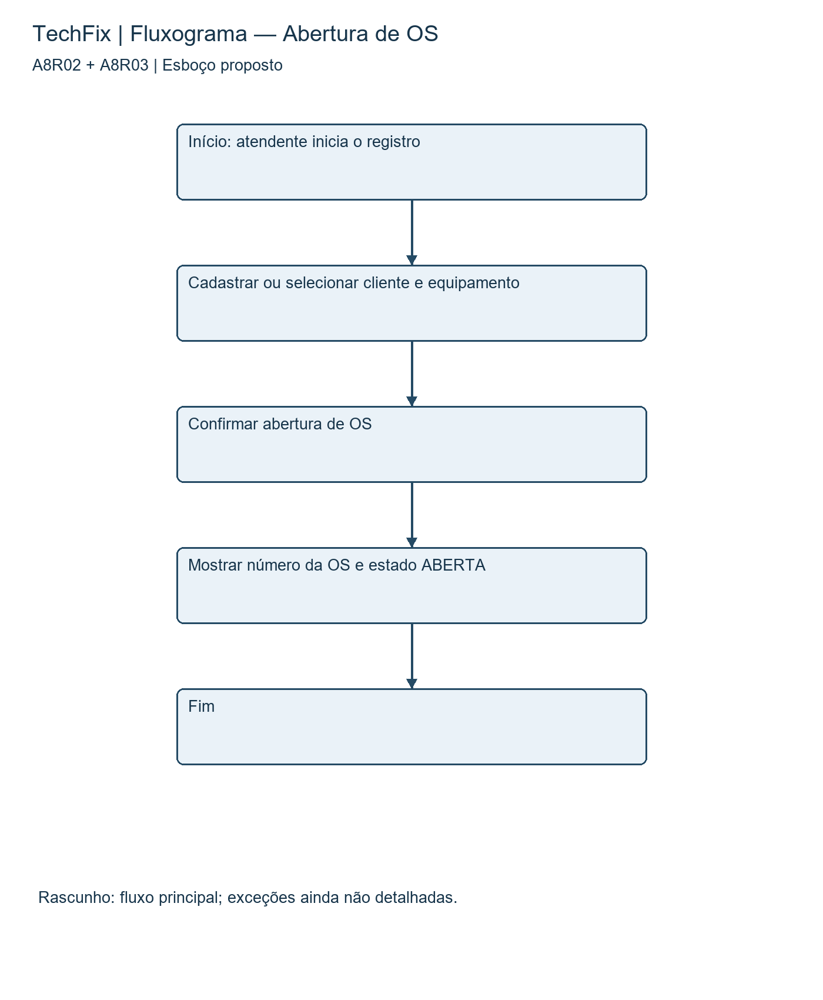

# Modelagem — Parte 1: esboço

## 1. Identificação

Atividade (código e nome): Modelagem — Parte 1: esboço

Etapa (AP1 / AP2 / AS): ____________________ (confirmar no AVA)

Equipe: TechFix

Integrantes: Arthur Scharfenberger e Lucas Oliveira da Silva

Data de entrega: ____________________ (preparação: 30/09/2026)

## 2. Conteúdo da atividade

## 2.1 Funcionalidades escolhidas

A8R02 — Cadastrar cliente e equipamento vinculado; A8R03 — Abrir ordem de serviço. Ambos são Must have do I1 da A8 revisada, originados de RF1, RF2, RN1 e HU1. Foram escolhidos porque iniciam todo atendimento e permitem demonstrar valor ao atendente.

Este esboço foi preparado nesta revisão; não é apresentado como registro de uma oficina passada. A atividade de modelagem não recebeu número no enunciado fornecido, portanto o código deverá ser confirmado no AVA.

## 2.2 Primeiro modelo: fluxograma

## 2.3 Início da explicação

O fluxograma representa o caminho principal do atendente, desde a seleção ou cadastro de cliente e equipamento até a confirmação de uma OS ABERTA. A8R02 aparece no cadastro; A8R03 aparece na abertura e no protocolo. A sequência ajuda a identificar os passos e as dependências antes de definir telas ou implementação.

Pontos ainda incompletos neste rascunho: campos obrigatórios, vínculo entre cliente e equipamento, autorização, falha ao salvar, data de abertura e evento inicial do histórico. A etapa final detalha essas situações e acrescenta um wireframe para explicar a interação.

3. Decisões e pendências

Registre as principais decisões tomadas pela equipe nesta etapa e o que ainda está pendente para a próxima entrega.

Decisões tomadas: Manter A8R02 e A8R03 como foco da modelagem. Próxima etapa: detalhar exceções e a tela de abertura, usando os mesmos IDs da A8 revisada. Validar com os integrantes antes de enviar.

Pendências / próximos passos: revisar o conteúdo com os integrantes, confirmar estimativas e decisões propostas, preencher etapa e data efetiva de entrega e assinar após validação. Na modelagem, confirmar também o código da atividade no AVA.

4. Declaração de uso de Inteligência Artificial

Conforme o Manual da Disciplina (seção 6 — Uso de Inteligência Artificial), toda utilização relevante de IA no desenvolvimento desta atividade deve ser declarada abaixo e também registrada no arquivo DEVLOG.md do repositório do projeto. Se a equipe não utilizou IA nesta atividade, marque a opção correspondente e não é necessário preencher a tabela.

( ) A equipe não utilizou ferramentas de IA nesta atividade.

(X) A equipe utilizou ferramentas de IA nesta atividade — declaração abaixo.

| Data e ferramenta | Objetivo do uso | Prompt ou resumo da interação | Resultado aproveitado / rejeitado / modificado |
|---|---|---|---|
| 30/09/2026 — ChatGPT/Codex | Preparar e revisar as três entregas de Processos e preencher o documento padrão fornecido. | Confrontar A5 e A8; organizar backlog, estimativas, incrementos e riscos; produzir e explicar modelos ligados ao backlog; adequar todos os arquivos à estrutura institucional. | Texto e diagramas aproveitados como proposta. Estrutura conferida com o modelo; consenso e validação pelos integrantes ainda pendentes. |

Forma de verificação adotada pela equipe: proposta para revisão — confronto com A5, A4 e A8 original; conferir rastreabilidade, modelos, estimativas e critérios. Na preparação com IA foram conferidos o conteúdo e a estrutura dos DOCX; a validação dos integrantes ainda está pendente.

Responsável pela decisão final sobre o uso: Arthur Scharfenberger e Lucas Oliveira da Silva.

5. Responsabilidade e autoria

A equipe declara que este documento foi lido, compreendido e validado por todos os integrantes, que respondem integralmente pela correção, coerência, legalidade e autoria do conteúdo entregue. Qualquer integrante poderá ser questionado, em apresentação, sobre partes produzidas com apoio de IA.

Assinatura (nomes por extenso):

Arthur Scharfenberger: ____________________________________________________

Lucas Oliveira da Silva: ____________________________________________________

Validação e assinaturas pendentes: a declaração acima deverá ser confirmada pelos integrantes após leitura e revisão.
